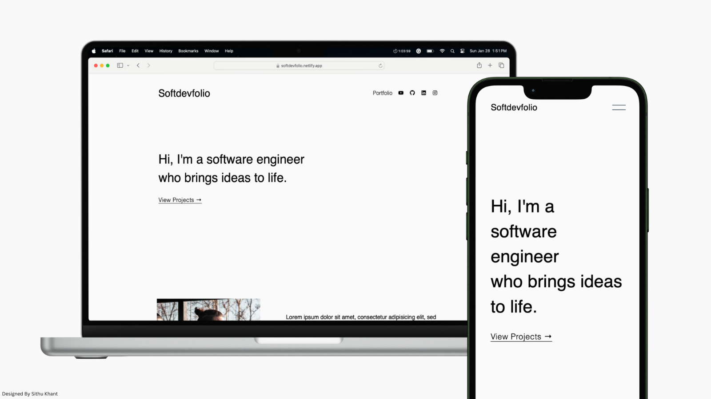

# Softdevfolio   

Awesome Portfolio Template for Software Engineers/Developers.



**This template is featured in [The Complete Web Developer Course](https://zerotomastery.io/courses/coding-bootcamp/) by
Zero To Mastery Academy.**

## Features

* Nice and Clean Modern UI Design
* Multiple Page Layout
* Fully Responsive
* Styled with Pure Custom CSS

## Live Demo

* **Vercel** - **[click here](https://softdevfolio.vercel.app/)**
* **Netlify** - **[click here](https://softdevfolio.Netlify.app/)**

[//]: # (## To support my work?)

[//]: # ()
[//]: # (<a href="https://www.buymeacoffee.com/sithukhant" target="_blank"></a>)

### Folder Structure

```
├─ assets
│   ├── css
│   │   ├── base.css                # To style navbar and footer
│   │   ├── style.css               # To style pages
│   ├── images                      
│   │   ├── project-cover-1.png    
│   │   ├── project-cover.png
│   ├── favicon.ico
│   ├── home-cover-1.png
│   ├── home-cover.png
│   ├── profile-1.png
│   ├── profile.png
├─ templates
│   ├── footer.html
│   ├── navbar.html
├── .gitignore
├── LICENSE
├── README.md
├── _redirects
├── index.html
├── portfolio.html
├── template.js
└── vercel.json
```

* `assets` - To keep all your resources here.
    * `css` - To store all your style files.
    * `images` - To Store your images for projects from Portfolio page.
        * Image size should be `400px 300px`.
    * `favicon.ico`
    * `home-cover.png / home-cover-1.png` - The image size should be `1500px 350px`.
        * Default image -  `home-cover.png`.
        * Realistic image - `home-cover-1.png`.
    * `profile.png / profile-1.png` - The image size should be `500px 500px`.
* `templates` - To store template files.
    * Footer template - `footer.html`.
    * Navbar template - `navbar.html`.
* `_redirects` - To remove `.html` extension when you host on **Netlify**.
    * `https://www.softdevfolio.app/portfolio.html` become `https://www.softdevfolio.app/portfolio`.
* `template.js` - For inserting template files to the page.
* `vercel.json` - To remove `.html` extension when you host on **Vercel**.

### Prerequirements

* None (but `git`, of course!)

### Live Server (Optional)

If you want to host it on local server using `live-server`,

1. To install

```bash
npm install -g live-server
```

`-g` means it will install it gloablly to access `live-server` command everywhere. Remove that if you just want to
install for this project. If you faced `npm not found error`, install it **[here](https://nodejs.org/en/download/)**.

2. Go to your project folder and type,

```bash
live-server
```

3. Press enter and your project will be hosted on `127.0.0.1:8080/`.

## Image Credits

* Photo by Emre
  Keshavarz: [link](https://www.pexels.com/photo/man-in-brown-suit-jacket-standing-near-green-trees-3739943/)
* Photo by Life Of Pix: [link](https://www.pexels.com/photo/silver-laptop-computer-next-to-ceramic-cup-42408/)
* Photo by Tatiana
  Fet: [link](https://www.pexels.com/photo/aerial-view-and-grayscale-photography-of-high-rise-buildings-1105766/)

## License

MIT License

## Authors

* **Sithu Khant** - [GitHub](https://www.github.com/sithu-khant)

## Acknowledgement

I was inspired and motivated to create this project because of [Simplefolio](https://github.com/cobiwave/simplefolio)
which is featured in [The Complete Web Developer](https://zerotomastery.io/courses/coding-bootcamp/) course of Zero To
Mastery Academy. I also wanted to contribute to the course with the one I created.

## Logs

* Wed Jul 17, 2024
    * (7.17.01) - Moved from my personal account.
* Thu Feb 1, 2024
    * (2.1.01) - Updated `README` from `2023` to `2024`.
* Tue Jan 30, 2024
    * (1.30.01) - Updated `README`.
* Mon Jan 29, 2024
    * (1.29.01) - Made `README` more readable.
    * (1.29.02) - Added knowledgement section to the readme file.
* Sun Jan 28, 2024
    * (1.28.01) - Added realistic photos.
* Sat Jan 27, 2024
    * (1.27.01) - Added responsive style to portfolio page.
    * (1.27.02) - Fixed some styleing for responsive.
    * (1.27.03) - Added `vercel.json` file for Vercel.
    * (1.27.04) - Added `_redirects` file for Netlify.
    * (1.27.05) - Added `Copyright` text to each file
* Fri Jan 26, 2024
    * (1.26.01) - Finished home-cover section and fixed some styling.
    * (1.26.02) - Finished home page.
    * (1.26.03) - Added portfolio page and styled projects.
* Thu Jan 25, 2024
    * (1.25.01) - Finished hero section and intro section.
* Mon Jan 1, 2024
    * (1.1.01) - Navbar working.
    * (1.1.02) - Added styles to navbar and responsive.
* Sun Dec 31, 2023
    * (12.31.01) - Started the project.
    * (12.31.02) - Added `navbar` section.
